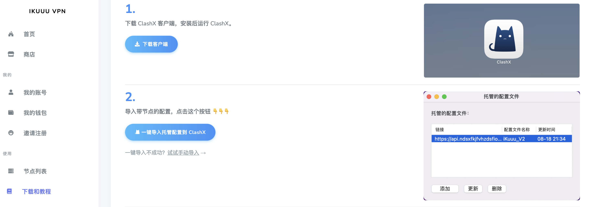
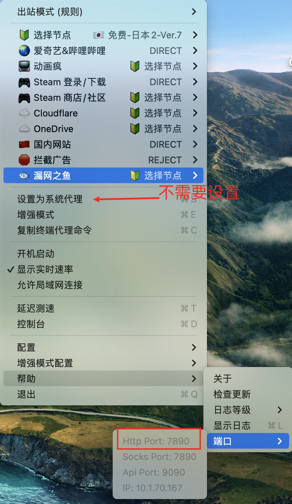
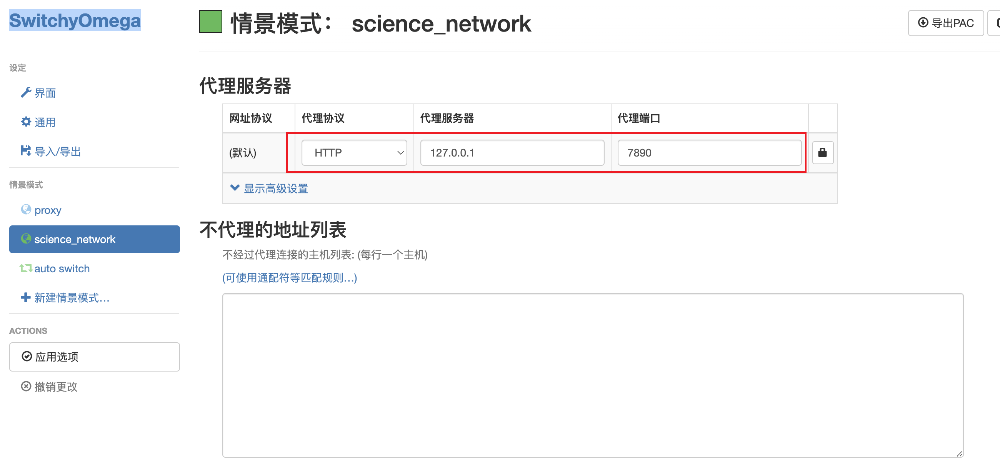
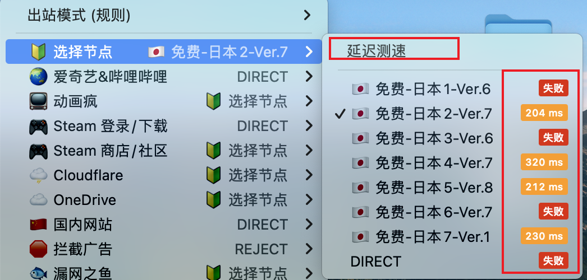
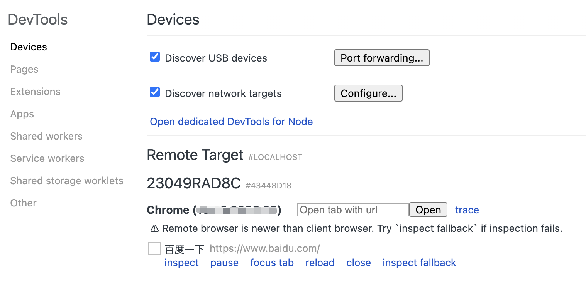
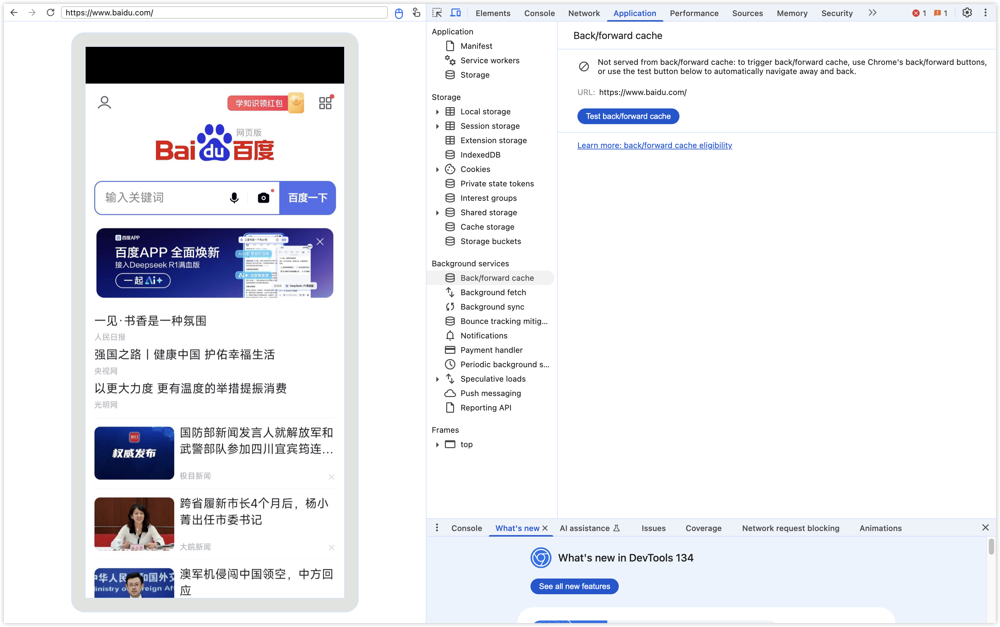
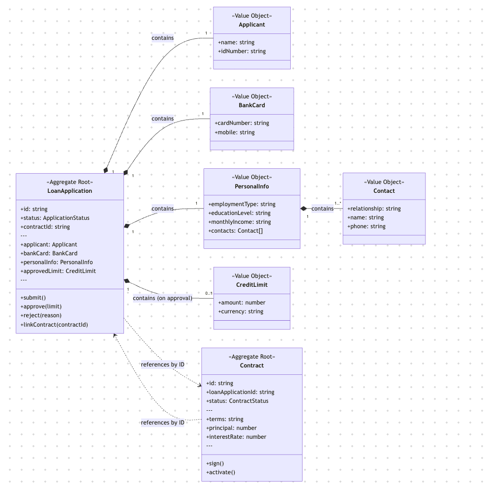

# 日常开发工具

## 科学上网

ikuuu 本身无需科学上网即可进入，里面有 clash 的下载链接。

[ikuuu](https://ikuuu.one/user){link=static}

下载 clash 后，点击 ikuuu 的【一键导入托管配置到Clash】，导入配置。



Clash 不需要【设置为系统代理】。Clash 默认的端口号是 7890，Chrome 的 SwitchyOmega 插件配置转发规则。





这样子配置完成后，打开 switchyomega 选择对应的科学上网情景模式配置即可科学上网。

如果网络不通，可以查看是不是代理节点不可用，切换成延时比较低的即可。



高级用法，可以使用 SwitchyOmega 的 auto switch 模式，配置需要科学上网的域名，自动使用科学上网配置，其它的域名使用系统代理。


## 使用Chrome调试手机网页

[chrome调试手机网页](https://silent.blog.csdn.net/article/details/139336996){link=static}

[如何使用edge浏览器或chrome谷歌浏览器调试手机端网页（微信网页、浏览器皆可](https://blog.csdn.net/ForidaAxu/article/details/135748032){link=static}

Edge 同理，区别在于 Chrome 需要科学上网，Edge 不需要。

1. 手机打开开发者模式（一般在手机全部参数的页面，连续点击系统版本号），并且打开 USB 调试开关（在设置直接搜索usb调试）。

2. Chrome 开启科学上网，打开 `chrome://inspect/#devices`。

3. 用 USB 线连接电脑和手机，注意要**使用正装 USB 数据线**，盗版便宜的 USB 数据线可能没有调试功能。正装的线插上去会弹出调试的提示。



4. 手机打开浏览器，打开一个页面，Chrome 就可以看到手机的页面。点击 `Inspect`，就可以调试手机的页面。



## 启动本地服务方式

### http-server(good)

以 Mac 为例。

全局安装 `http-server`： 

```bash
npm install -g http-server
```

如果遇到权限不足的报错，可以使用 `sudo` 命令，需要输入一遍 Mac 密码。

```bash
/usr/local/bin/http-server -> /usr/local/lib/node_modules/http-server/bin/http-server
npm ERR! code EACCES
npm ERR! syscall symlink
```

```bash
sudo npm install -g http-server
```

在项目文件夹中启动 http-server 服务器：

```bash
http-server
```

默认情况下，HTTP 服务器将在 `localhost:8080` 上运行。这样即可访问文件，如 `http://localhost:8080/yourfile.js`。

### serve

serve 在本地启动一个静态资源服务器，可以在本地运行查看项目打包的效果。

:::tip node版本≥14
serve v14 onwards requires Node v14 to run. Please use serve v13 if you cannot upgrade to Node v14.
:::

安装。

```bash
npm install -g serve
```

启动服务器，首先先打包完本地项目，一般会生成 `build` 或 `dist` 目录。

```bash
# 进入build或dist目录
serve

# 在项目根目录
serve -s build
serve -s dist

# 指定端口号
serve -p 3000
```

### 使用 Live Server 插件

安装使用 vscode 的 Live Server 插件。右键点击编辑器中的 HTML 文件，选择 `Open with Live Server`。

但这种方式只能访问 HTML 文件，不能访问 JS 文件。

## yalc神器-前端link调试

[yalc: 可能是最好的前端link调试方案](https://juejin.cn/post/7033400734746066957){link=card}

使用背景：你在开发一个 **组件库/sdk/插件** 或 **其他npm库**，想知道它们在前端项目上使用的真实效果。

举个栗子：你在开发一个组件 hello-ui，想要知道它在另一个前端项目 world-fe 中的效果如何，应该怎么做？

没有了解 yalc 之前，我的做法主要有两种：

- 组件出包后再调试：组件 hello-ui 进行构建发布（出包），将构建产物发布到公司的 npm 上，得到一个新的组件版本号，接着在 world-fe 项目中更新组件的版本号，运行 `npm install` 命令更新组件。这种方法比较麻烦。

- 直接在 world-fe 项目的 node_modules 中直接修改 hello-ui 组件的代码，查看效果，确认效果无误后，再到 hello-ui 的仓库中同步代码。这种方法，同步代码到组件库中，很容易出错，很容易遗漏代码。

现在了解了 yalc，一切就变得简单了。

### yalc是什么

[Yalc github](https://github.com/wclr/yalc){link=static}

> Better workflow than npm | yarn link for package authors.
>
> 对包开发者来说，比 npm | yarn link 更好的开发流程。

`When developing and authoring multiple packages (private or public), you often find yourself in need of using the latest/WIP versions in other projects that you are working on in your local environment without publishing those packages to the remote registry. `

yalc 的主要功能是：在不需要把包发布到远程仓库的情况下，在本地项目中使用最新的包。真正做到「立竿见影」的效果。

### yalc的基本使用

安装 yalc：`npm i -g yalc`。

使用 yalc：

1. yalc publish 发布依赖

在 hello-ui 中执行 `yalc publish`。它会把需要发布的内容保存到全局缓存之中。

```bash
yalc publish
```

运行成功后，会看到控制台打印如下内容。

```bash
hello-ui@1.0.0 published in store
```

2. yalc add 添加依赖

在 world-fe 项目中，执行 `yalc add hello-ui`。这样一来，world-fe 项目 node_modules 目录中的 hello-ui 就更新为最新内容了。

```bash
yalc add hello-ui
```

运行成功后，会看到控制台打印以下内容。

```bash
Package hello-ui@1.0.0 added ==> /Users/zhangsan/projects/world-fe/node_modules/hello-ui
```

同时，world-fe 项目的 package.json 文件中，hello-ui 的版本号会变为 `file:.yalc/hello-ui`，代表使用 yalc 缓存的组件内容。

3. yalc push 推送和更新

如果你在 hello-ui 修改了代码，只需要执行 push 命令，最新的包的内容就会直接更新到 world-fe！直接触发了 HRM。

```bash
yalc publish --push
# 简写
yalc push
```

4. yalc remove 移除依赖

在 world-fe 执行：

```bash
yalc remove hello-ui
```

就能移除 yalc 的 hello-ui 依赖，但是原本的 hello-ui 依赖不会恢复，需要手动 npm i 重新安装一下。

5. yalc update 更新依赖

其实 yalc push 后会自动更新包，也用不着这个命令了。

```bash
yalc update hello-ui
```

## classnames

一个实用的工具库，方便我们根据条件动态组合类名。

安装 `classnames`。

```bash
npm install classnames
```

用法。

```jsx
import classNames from 'classnames';

class App extends React.Component {
  render() {
    return (
      <div className={classNames(
        'btn', 
        { 'btn--red': isRed },
        { 'btn--blue': isBlue}
      )}>
        Hello World!
      </div>
    );
  }
}
```

## moment

一个日期时间工具库，在 JavaScript 中解析、校验、操作和展示日期和时间。

[moment 中文网](https://momentjs.cn/){link=card}

[moment 英文网](https://momentjs.com/){link=card}

### 安装

```bash
npm install moment --save
```

### 格式化为日期时间字符串

注意 `HH:mm:ss` 和 `hh:mm:ss` 的区别，前者是24小时制，后者是12小时制。

```js
moment().format('YYYY-MM-DD HH:mm:ss'); // 2023-01-01 17:20:20
moment().format('YYYY-MM-DD hh:mm:ss'); // 2023-01-01 05:20:20
moment(new Date()).format('YYYY-MM-DD HH:mm:ss'); // 2023-01-01 17:20:20
moment(1703150359094).format('YYYY-MM-DD HH:mm:ss'); // 2023-12-21 17:19:19
```

### 计算时间差

使用 `moment().diff()`，计算两个时间的差值。

```js
moment().diff(Moment|String|Number|Date|Array);
moment().diff(Moment|String|Number|Date|Array, String);
moment().diff(Moment|String|Number|Date|Array, String, Boolean);
```

参数1：要判断的时间值，格式支持 `Moment|String|Number|Date|Array`。

参数2：比较的单位，可以为 `years, months, weeks, days, hours, minutes, seconds`，默认单位值毫秒。

参数3：是否保留小数。默认是截断小数点后的位数，取整数，如 0.5 返回 0。

如果前者时间比后者时间大，返回正值，相反则返回负值，因此也可以用来比较两个时间的大小。

```js
var a = moment('2023-12-22 16:18:15');
var b = moment('2023-12-22 16:18:10');

a.diff(b); // 5000
a.diff(b,'seconds'); // 5，表示a比b多5秒
a.diff(b, 'minutes'); // 0
a.diff(b, 'minutes', true); // 0.08333333333333333
b.diff(a); // -5000
```

### 判断两个时间大小

使用 `moment().diff()`，根据差值的正负判断时间的大小。

```js
// 正值：前者时间比后者时间大。
// 负值：前者时间比后者时间小。
// 0：前者时间和后者时间相等。
var a = moment('2023-12-22 16:18:15');
var b = moment('2023-12-22 16:18:10');

a.diff(b); // 5000
b.diff(a); // -5000
```

### 常用时间

```js
moment().format('YYYY-MM-DD'); // 今天
moment().add(1, 'day').format('YYYY-MM-DD'); // 明天
moment().subtract(1, 'day').format('YYYY-MM-DD'); // 昨天
moment().subtract(29, 'day').format('YYYY-MM-DD'); // 30天前
moment().startOf('month'); // 本月初
moment().endOf('month'); // 本月末
moment().startOf('week'); // 本周初
moment().endOf('week'); // 本周末
moment().month(moment().month() - 1).startOf('month'); // 上个月初
moment().month(moment().month() - 1).endOf('month'); // 上个月末
```

## NVM

nvm 是管理 node 版本的快捷工具，使用它可以十分方便地切换 node 版本。

### nvm 常用命令

```bash
nvm list     // 查看已安装的 node 版本
nvm install <version>       // 安装某个版本的 node，如：nvm install 12.22.22
nvm use <version>      // 使用某一版本的 node
nvm uninstall <version>   // 卸载指定版本的 node
```

### nvm 的安装

[nvm 详细安装步骤以及使用（window10 系统）](https://blog.csdn.net/Anony_me/article/details/124153201){link=card}

### nvm 使用问题

1、nvm 下载 node 很慢，或者卡住、下载失败

打开 nvm 目录，找到 setting.txt 文件打开。

复制如下代码。

```
node_mirror: https://npmmirror.com/mirrors/node/
npm_mirror: https://npmmirror.com/mirrors/npm/
```

[nvm 下载node时很慢或卡住或下载失败](https://zhuanlan.zhihu.com/p/683202282){link=static}

2、 `nvm use xxx` 命令报权限不足

使用管理员身份运行 cmd，再运行这个命令。

[nvm use 报错：You do not have sufficient privilege to perform this operation](https://blog.csdn.net/JudyC/article/details/121702250){link=static}

## Npm

### Npm 常用命令

[npm常用命令大全](https://blog.csdn.net/penngo/article/details/127845211){link=static}

1、设置镜像

```bash
#1,淘宝镜像源
npm config set registry https://registry.npmmirror.com
# 这个淘宝镜像源用不了了，报证书无效的错误
npm config set registry https://registry.npm.taobao.org

#2,腾讯云镜像源
npm config set registry http://mirrors.cloud.tencent.com/npm/

#3,华为云镜像源
npm config set registry https://mirrors.huaweicloud.com/repository/npm/

# 官方默认全局镜像
npm config set registry https://registry.npmjs.org

#检查当前镜像
npm config get registry
```

2、安装依赖

```bash
# 全局安装
npm install express -g
npm install express --global

# 安装到运行时依赖dependencies
npm install express --save
npm install express -S

# 安装到开发时依赖devDependencies
npm install express --save-dev
npm install express -D
```

### npm 使用问题

1、Windows 系统，vscode 终端运行 npm 命令，报错「找不到命令」

问题描述：cmd 中可以运行，但 vscode 中无法运行。`node -v` 都无法运行。

解决办法：使用管理员身份打开 powershell，输入 `set-executionpolicy remotesigned` 命令，它会提示安全风险，输入「y」回车确认即可。

再重启电脑，vscode 就能正常使用 node 和 npm 命令。

[Vscode 无法运行 npm 命令 报错 - 程序“npm”无法运行: 找不到应用程序所在位置](https://blog.csdn.net/qq_45094823/article/details/139946346){link=card}

2、npm 安装很慢怎么解决

可以先切换镜像源，如果还是很慢，使用 cnpm 进行依赖安装。

```bash
# 注册模块镜像
npm set registry https://registry.npmmirror.com  

# node-gyp 编译依赖的 node 源码镜像  
npm set disturl https://npmmirror.com/dist 

# 清空缓存  
npm cache clean --force  

# 安装cnpm  
npm install -g cnpm --registry=https://registry.npmmirror.com

# 使用cnpm安装依赖
cnpm install xxx
```

[npm使用国内淘宝镜像（最新地址](https://blog.csdn.net/chaoPerson/article/details/136121885){link=static}

## Charles

Charles 是网络代理应用软件。

:::warning 提示
以下操作均在 Windows 系统下进行。Mac 系统自行查阅资料。
:::

### 安装

从[官网](https://www.charlesproxy.com/)下载无脑安装即可。

Charles 的注册码通行证，自行搜索找吧。

### 开启系统代理

路径：`Proxy -> Windows Proxy`。


### 抓取 http 网络包

路径：`Proxy -> Proxy Settings`。

端口填 8888，`Enable transparent HTTP proxying` 勾选上。


### 抓取 https 网络包

安装上 CA 证书即可。

路径：`Help -> SSL Proxying -> Install Charles Root Certificate`。


安装步骤，如图所示。


安装好后，查看有效期是否正确即可。

### 域名重定向

域名重定向，是指将指定的网络请求重定向到另一个地址。可以避免本地运行项目时的接口跨域问题。

路径：`Tools -> Map Remote`。


这个配置的含义是，将 `test.local.com` 的请求映射到本地的 3002 端口（本地项目运行的端口），也就是访问 `test.loca.com` 其实就是访问 `127.0.0.1:3002`。

如果直接访问 `127.0.0.1:3002`，会出现跨域问题，和接口的域名不一致。

配置好的域名重定向，可以导出成 `xml` 文件，下次使用可以一键导入。


## Nginx

[连前端都看得懂的《Nginx 入门指南》](https://juejin.cn/post/6844904129987526663){link=card}

## PlantUML

PlantUML 是一个画图工具。

可以在其官方网站上在线画图，也可以在 vscode 中安装插件画图。

个人推荐在 vscode 中画，样式更好看，下面以 vscode 插件画图为例说明流程。

[PlantUML 一览](https://plantuml.com/zh/){link=card}

### 安装 Java

PlantUML 的预览需要安装 Java。所需最低版本为 Java 8。

具体安装教程查一查网络资料。

```bash
# 查看 Java 版本
java -version
```

### vscode 安装插件

在 vscode 搜索 PlantUML 插件，安装即可。


### 书写画图代码

以画树结构图标为例。

[官方文档教程](https://plantuml.com/zh/salt)

```bash
@startsalt
{
  {T
  +目录结构        | 说明  
  + src        | 资源目录
  ++ <color:#db8e00>api</color> | <color:#db8e00>存放api接口定义文件</color> 
  +++ ...
  ++ <color:Green>components</color> | <color:Green>存放页面上各个组件</color> 
  +++ comp1 | 组件1
  ++++ index.jsx | 组件入口
  ++++ index.scss | 组件1样式文件
  +++ ...
  +++ index.js | 渠道配置入口
  ++ pages | 存放页面代码
  +++ index | 首页
  ++++ index.jsx |  首页入口
  ++++ index.scss | 首页样式文件
  +++ ...
  ++ ...
  ++ utils | 存放公共方法
  +++ constant.js | 常量
  +++ ...
  ++ app.jsx | 模块入口
  ++ app.scss | 模块样式文件入口
  }
}
@endsalt
```

### 预览图表

> Preview Diagram, Press **Alt + D** to start PlantUML preview (**option + D** on MacOS).

注意需要安装 Java 才能正常预览。

常见的代码目录结构图。


## Mermaid在线编辑器

[Mermaid在线编辑器](https://www.processon.com/mermaid){link=static}

Mermaid是一种基于JavaScript的图表工具，能够通过Markdown风格的文本定义动态创建和修改图表‌，广泛应用于流程图、时序图、甘特图等多种可视化需求。‌‌

```ts
classDiagram
  direction LR

  subgraph Loan Application Aggregate
      class LoanApplication {
          <<Aggregate Root>>
          +id: string
          +status: ApplicationStatus
          +contractId: string
          ---
          +applicant: Applicant
          +bankCard: BankCard
          +personalInfo: PersonalInfo
          +approvedLimit: CreditLimit
          ---
          +submit()
          +approve(limit)
          +reject(reason)
          +linkContract(contractId)
      }

      class Applicant {
          <<Value Object>>
          +name: string
          +idNumber: string
      }

      class BankCard {
          <<Value Object>>
          +cardNumber: string
          +mobile: string
      }

      class PersonalInfo {
          <<Value Object>>
          +employmentType: string
          +educationLevel: string
          +monthlyIncome: string
          +contacts: Contact[]
      }

      class Contact {
          <<Value Object>>
          +relationship: string
          +name: string
          +phone: string
      }

      class CreditLimit {
          <<Value Object>>
          +amount: number
          +currency: string
      }
  end

  subgraph Contract Aggregate
      class Contract {
          <<Aggregate Root>>
          +id: string
          +loanApplicationId: string
          +status: ContractStatus
          ---
          +terms: string
          +principal: number
          +interestRate: number
          ---
          +sign()
          +activate()
      }
  end

  %% --- Relationships ---
  LoanApplication "1" *-- "1" Applicant : contains
  LoanApplication "1" *-- "1" BankCard : contains
  LoanApplication "1" *-- "1" PersonalInfo : contains
  LoanApplication "1" *-- "0..1" CreditLimit : contains (on approval)
  PersonalInfo "1" *-- "1..*" Contact : contains

  %% --- Inter-Aggregate Relationship ---
  LoanApplication ..> Contract : references by ID
  Contract ..> LoanApplication : references by ID
```

