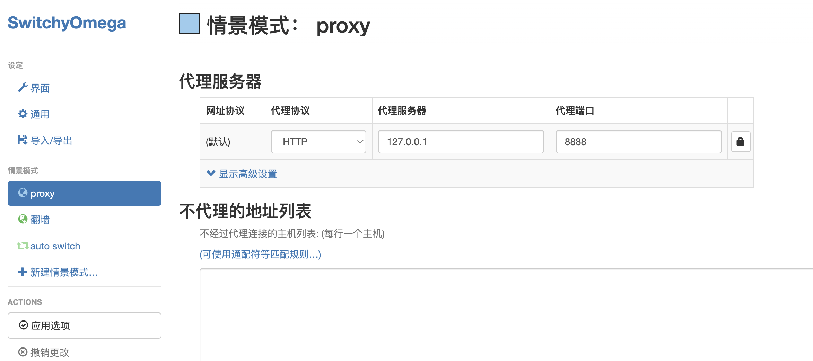
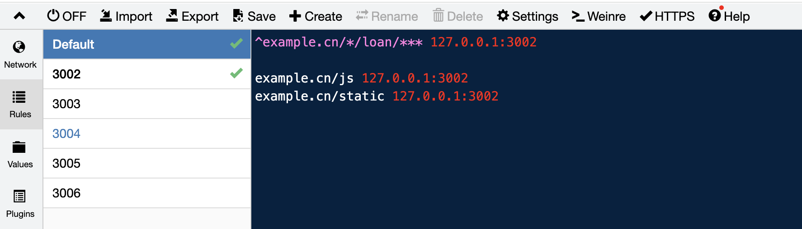

# whistle

[whistle 官网文档](https://wproxy.org/whistle/){link=static}

[Whistle 开发调试最佳实践](https://juejin.cn/post/7077385311642189832){link=static}

[鹅厂都在用的whistle](https://github.com/kaiye/kaiye.github.com/issues/27){link=static}

## whistle代理到本地服务

SwitchOmega 配置，将浏览器的请求都转发到 whistle 代理服务器上。



本地运行系统 127.0.0.1:3002，运行 `w2 start -p 8888` 启动 whistle，并配置规则。



```bash
^example.cn/*/loan/*** 127.0.0.1:3002

example.cn/js 127.0.0.1:3002
example.cn/static 127.0.0.1:3002
```

和预想的流程不一样，这样子配置后，首先是原来 https://example.cn/MINIAPP/module/js/chunk.0baauew1.js 的请求路径会变成 https://example.cn/js/chunk.0baauew1.js，接着 https://example.cn/js/chunk.0baauew1.js 再转发到本地服务器处理。

所以无法同时代理多个不同端口的本地运行系统，`example.cn/js/` 都变成相同的了，没有模块名之类的字段可以区分不同系统。

## 模拟弱网环境

访问某个地址，或者某个接口，延时 XXX 毫秒才返回，模拟某个接口特别慢的弱网环境。

使用 `resDelay` 字段。

```bash
# 延迟2000毫秒后才响应
www.baidu.com resDelay://2000
# mock 接口延迟2000毫秒后才响应
*/mock resDelay://2000
```

## 阻断请求

使用 `enable` 字段。

```bash
www.baidu.com enable://abort
```

## 将请求响应内容替换为指定内容

使用 `file` 字段。

```bash
# mock 接口返回指定文件内容
*/mock file:///Users/data.json
# a.com 和 c.com 返回指定内容
a.com file://({"code":12345,"message":"some_logic_error"})
c.com file://(<div>hijacking</div>{"code":0,"data":"success"})
```

## 往接口返回数据中追加内容

使用 `resAppend` 字段。

```bash
*/mock resAppend://{hijacking.html} 
``hijacking.html
<script>
alert('hijacking')
</script>
``
```

[使用whistle模拟cgi接口异常：错误码、502、慢网速、超时](https://blog.csdn.net/weixin_30719711/article/details/97225505){link=static}